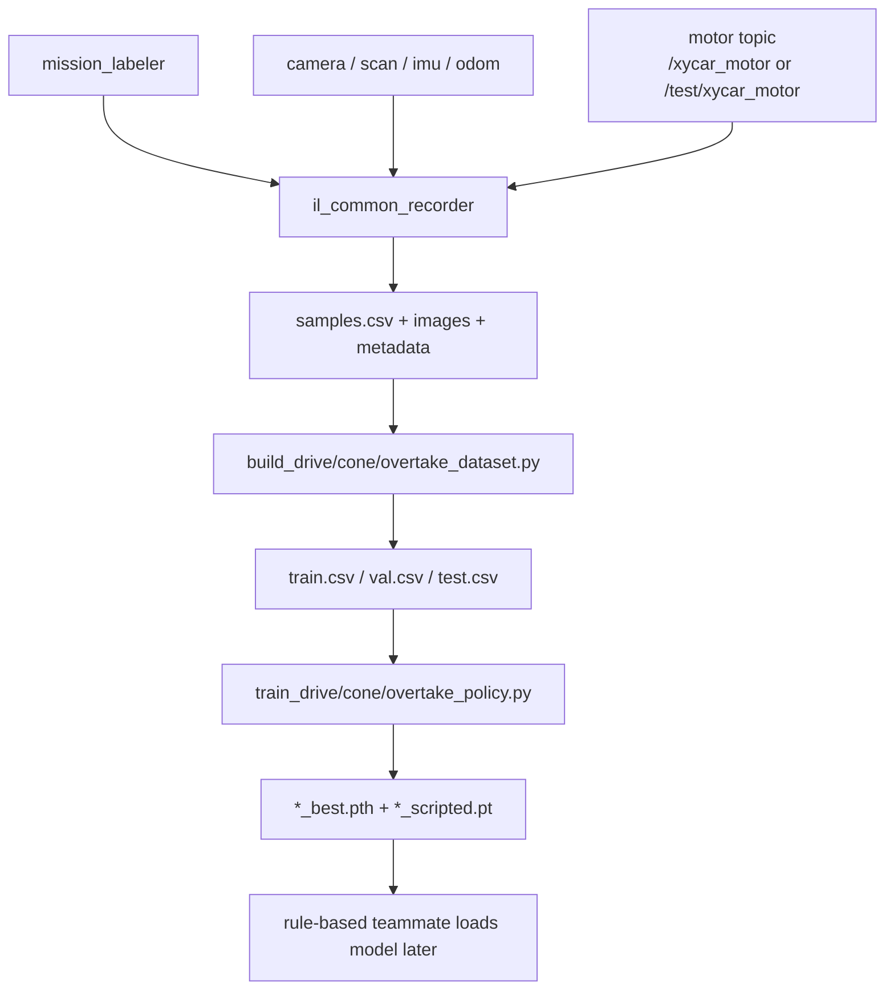

# il_data_tools 개요

`il_data_tools`는 Team K.A.I.의 ROS2 Humble 기반 Xycar 프로젝트에서 imitation learning 데이터를 모으고, 학습용 CSV로 가공하고, 조향 모델을 학습/평가/벤치마크하기 위한 보조 패키지입니다.

이 패키지의 핵심 원칙은 간단합니다.

- `il_data_tools`는 차량을 제어하지 않습니다.
- `il_data_tools`는 `/xycar_motor`를 publish하지 않습니다.
- recorder는 이미 존재하는 카메라, LiDAR, IMU, odom, motor command, mission label을 구독해서 저장만 합니다.
- 학습 모델은 steering만 출력합니다.
- 속도, 신호등, 보행자 정지, 긴급정지, 미션 전환, 주차, 최종 `/xycar_motor` publish는 rule-based 주행 코드 담당입니다.

## 왜 필요한가

대회 주행에는 신호등 출발, 차선 주행, 라바콘, 언덕, 보행자 회피, 차량 추월, 신호등 기반 경로 선택, shortcut, 3 lap, finish가 포함됩니다. 점수는 주행 시간과 penalty가 함께 반영되므로, 단순히 빠르게 가는 모델보다 안정적으로 조향하고 penalty를 줄이는 모델이 중요합니다.

`il_data_tools`는 사람이 운전하거나 rule-based 코드가 만든 `/xycar_motor` 명령을 이미지/센서 데이터와 함께 저장합니다. 이후 저장된 데이터를 가공해서 steering-only policy를 학습합니다.

## drive/cone/overtake를 나누는 이유

세 구간은 필요한 데이터 특성이 다릅니다.

- `drive`: 일반 차선 주행, 언덕, shortcut, recovery처럼 기본 주행 안정성이 중요합니다.
- `cone`: 라바콘 구간은 시야와 조향 패턴이 일반 차선과 다르고, LiDAR scan을 같이 보존할 수 있습니다.
- `overtake`: 차량 추월은 "시작-통과-복귀" 흐름이 중요해서 `phase` 컬럼을 만듭니다.

한 모델이 모든 것을 한 번에 배우게 하기보다, 먼저 profile별 데이터를 안정적으로 만들고 비교하는 쪽이 디버깅과 안전성에서 유리합니다.

## 패키지에 포함된 것

- `il_common_recorder`: 데이터 세션을 기록하는 ROS node
- `il_mission_labeler`: 키보드로 `/il/mission_label`을 publish하는 ROS node
- `record_*_dataset.launch.py`: drive/cone/overtake 수집 preset
- `build_*_dataset.py`: raw session을 train/val/test CSV로 변환
- `train_*_policy.py`: steering-only 모델 학습 wrapper
- `eval_policy.py`: TorchScript 모델 offline 평가
- `benchmark_policy_runtime.py`: TorchScript latency 측정
- `compare_models.py`: eval/benchmark 결과 비교
- `publish_dummy_il_stream.py`: 개발 노트북 local dry-run용 안전 dummy publisher

## 패키지에 포함되지 않은 것

- rule-based mission logic
- traffic light 판단
- pedestrian stop 판단
- emergency stop
- speed planning
- parking
- 최종 `/xycar_motor` publish node
- 실차 runtime 통합 node

모델 runtime 통합은 나중에 rule-based 담당 코드에서 TorchScript `.pt`를 읽어 steering만 참고하는 형태로 붙이는 것이 목표입니다. 현재 `il_data_tools` 안에 최종 차량 제어 node는 없습니다.

## 주요 구성요소 차이

| 구성요소 | 역할 | ROS 필요 | `/xycar_motor` 관련 |
|---|---|---:|---|
| recorder | 이미지/센서/motor/label을 세션으로 저장 | 예 | 구독만 함, publish 금지 |
| mission labeler | 키보드 label을 `/il/mission_label`로 publish | 예 | 무관 |
| dataset builder | raw session을 학습 CSV로 변환 | 아니오 | CSV의 motor angle/speed를 읽음 |
| training script | processed CSV로 steering model 학습 | 아니오 | 사용 안 함 |
| evaluation script | TorchScript 모델을 offline 평가 | 아니오 | 사용 안 함 |
| benchmark script | TorchScript latency 측정 | 아니오 | 사용 안 함 |

## 전체 흐름



텍스트로 보면 다음과 같습니다.

```text
mission_labeler + camera + motor topic
        ↓
il_common_recorder
        ↓
samples.csv + images
        ↓
build_*_dataset.py
        ↓
train_*.py
        ↓
*_policy_scripted.pt
        ↓
rule-based teammate loads model later
```

## rule-based 팀원 코드와의 관계

내 역할은 imitation learning 데이터 수집, dataset build, training, evaluation입니다. 다른 팀원이 담당하는 rule-based 주행/미션 코드는 최종 차량 제어와 안전 판단을 유지합니다.

따라서 학습 모델은 "조향 제안"만 합니다. 속도와 stop/go는 계속 rule-based가 결정해야 합니다. 이 분리를 유지해야 사고 위험과 디버깅 비용을 줄일 수 있습니다.

